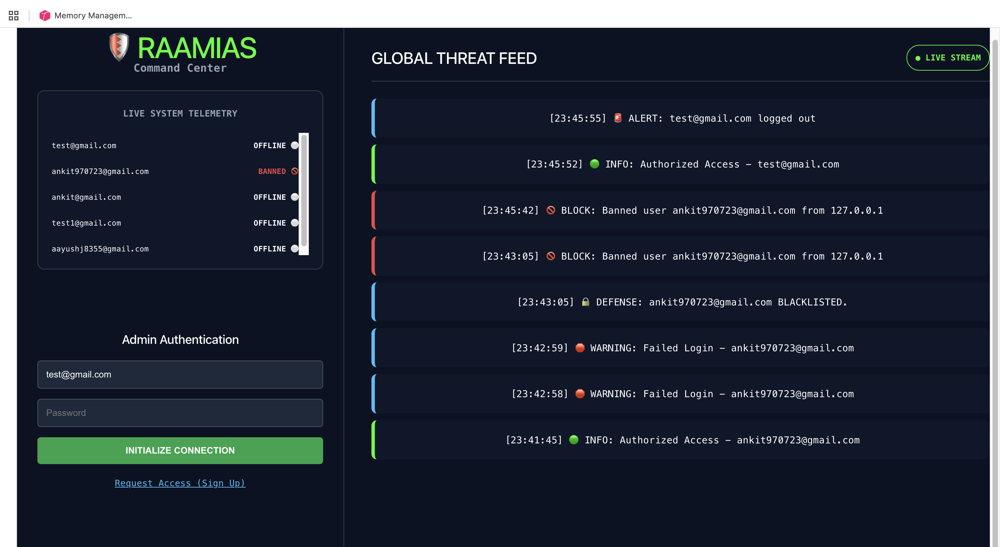
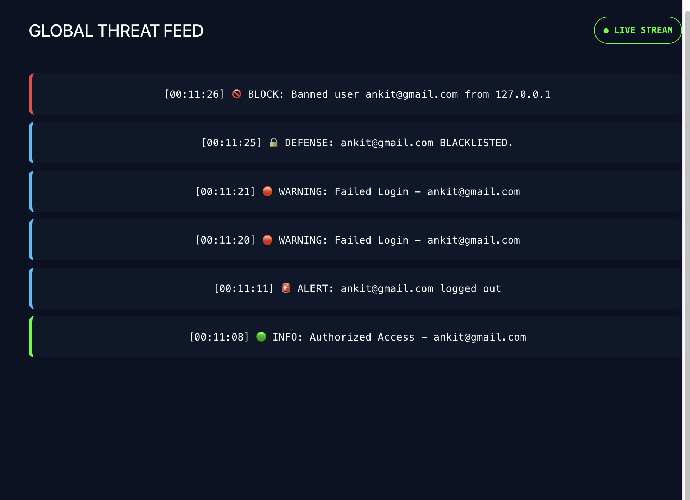
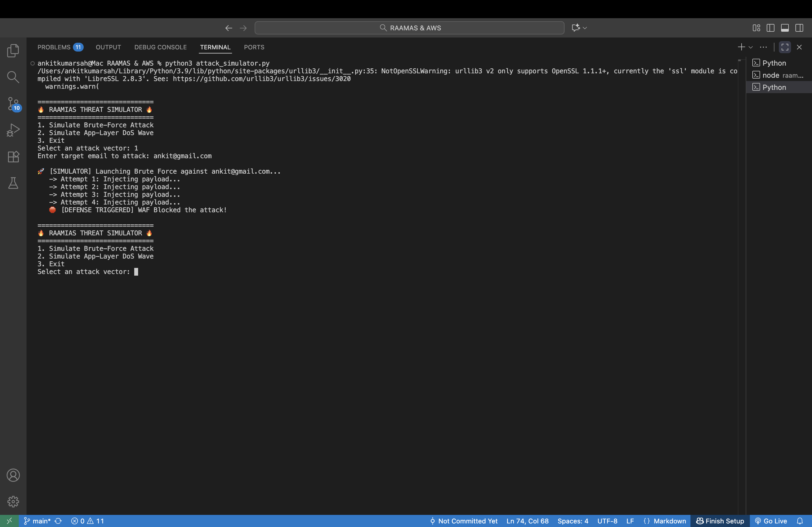
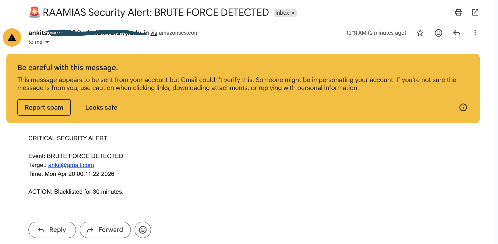

# 🛡️ RAAMIAS: Cloud-Native Command Center & Hybrid SIEM

## 📖 Overview
RAAMIAS (Real-time Authentication & Active Mitigation Information Alert System) is a hybrid-cloud security dashboard and WAF (Web Application Firewall) simulator. It integrates a local active defense database with **AWS Cognito** to provide real-time monitoring, brute-force protection, and automated incident response.

## ✨ Key Features
* **Real-Time Global Threat Feed:** Uses WebSockets to stream live authentication attempts, blocks, and system events to the frontend with zero latency.
* **Auto-Mitigation & Blacklisting:** Detects brute-force attacks (3 failed attempts within 10 seconds) and automatically blacklists the offending IP/Account for 30 minutes.
* **Enterprise Identity Management:** Validates all registrations and logins directly against **AWS Cognito** User Pools.
* **Strict Input Validation:** Implements Google-style Regex and Domain Whitelisting to prevent database pollution and injection attacks during registration.
* **Automated Security Alerts:** Triggers **AWS SNS** and **AWS SES** to send instant email/SMS alerts to administrators when a critical threat is detected.
* **Live Threat Simulation:** Includes a Python-based attack simulator to test the WAF's response to brute-force and application-layer wave attacks.

---

## 🧠 Architecture Deep-Dive (How It Actually Works)

This project simulates enterprise-level SIEM (Security Information and Event Management) workflows, similar to tools like Wazuh, but built from scratch using Python and AWS.

### 1. Where are the users stored? (Identity Management)
**Users are NOT stored in a local database.** The Single Source of Truth (SSOT) for all identities is **AWS Cognito**. 
* When a user registers, the FastAPI backend validates the domain and character structure, then securely provisions the user in the AWS Cloud.
* The local SQLite database is only used ephemerally to track *state*—specifically, who is currently online and who is currently serving a 30-minute IP/Account ban. 

### 2. How does the "Global Threat Feed" get its logs?
The logs are generated via an **Event-Driven WebSocket Architecture**. 
* Whenever an event occurs (a successful login, a failed password, a brute-force trigger), the `main.py` backend captures the event.
* Instead of waiting for the frontend to ask for updates (polling), the FastAPI `ConnectionManager` instantly pushes a formatted log string over a persistent `ws://` (WebSocket) connection.
* The React frontend is passively listening to this socket and appends the new log to the terminal UI in milliseconds, color-coding it based on threat severity (e.g., Red for `BLOCK`, Green for `SUCCESS`).

### 3. What is the role of AWS in this project?
AWS is the backbone of the system's security and alerting infrastructure:
* **Amazon Cognito:** Handles the heavy lifting of cryptographic password hashing, token generation (JWTs), and user pooling. 
* **Amazon SES (Simple Email Service):** Acts as the automated dispatcher, sending out 6-digit verification codes to ensure emails are valid before provisioning.
* **Amazon SNS (Simple Notification Service):** Serves as the emergency alarm. If the local WAF detects a brute-force attack, it triggers an SNS payload that can instantly text or email the SOC (Security Operations Center) team.

---

## 📸 System in Action

**Active Threat Mitigation**

**Live Threat Simulator**

**AWS Integration & Alerting**

---

## 🛠️ Tech Stack
* **Frontend:** React, Vite, Flexbox (SOC Enterprise UI)
* **Backend:** Python, FastAPI, WebSockets
* **Database:** SQLite (Local WAF/Blacklist state)
* **Cloud Infrastructure:** AWS Cognito, AWS IAM, AWS SNS, AWS SES

## 🚀 Setup & Installation

### Backend Setup (FastAPI)
1. Navigate to the backend directory.
2. Install requirements: `pip install fastapi uvicorn boto3 sqlalchemy pydantic`
3. Update `main.py` with your AWS credentials and User Pool IDs.
4. Run the server: `uvicorn main:app --reload`

### Frontend Setup (React/Vite)
1. Navigate to the frontend directory.
2. Install dependencies: `npm install`
3. Start the dev server: `npm run dev`

### Running the Simulator
1. Open a new terminal instance.
2. Run `python attack_simulator.py` to test the WAF's brute-force defense limits.

## 👨‍💻 Developer
Developed as a proof-of-concept for Cloud Security and Active Defense methodologies.